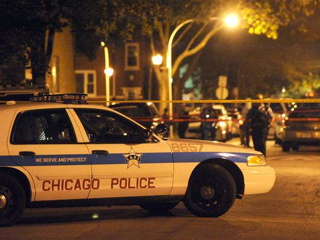
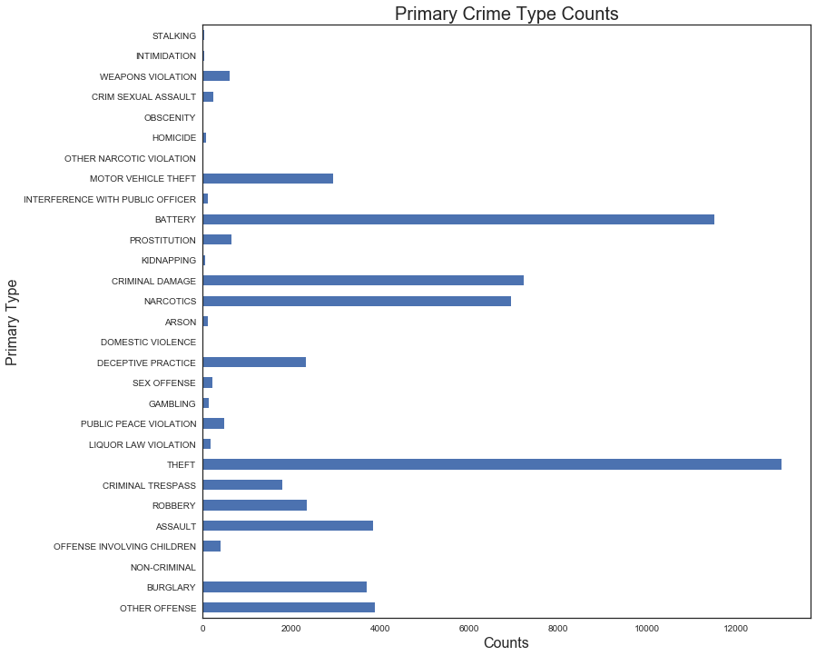
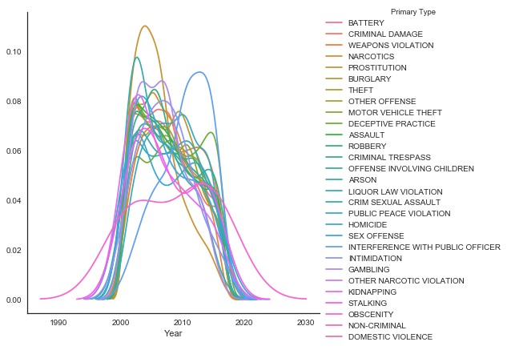
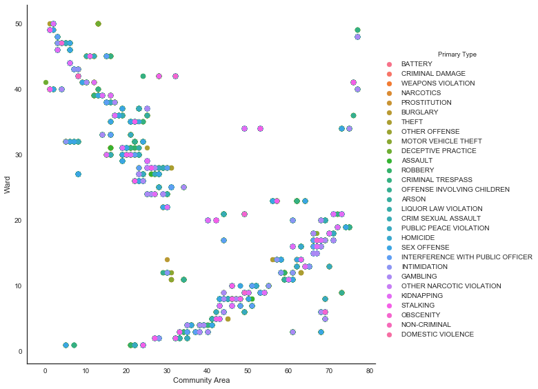
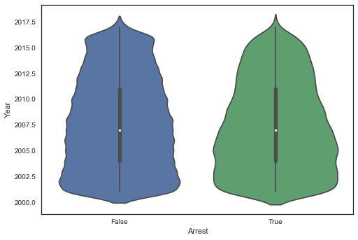

Fall 2017, DATA 550 Data Visualization - Dr. Bora Pajo

## PURPOSE

To analyze the chicago crime dataset and produce at least two visualizations. 

Using pandas, seaborn, numpy, and matplotlib 
Created bar chart, boxplot, scatter plot, violin plot, and kdeplot 

## DATA SOURCE 

https://data.cityofchicago.org/Public-Safety/Crimes-2016/kf95-mnd6/data

This dataset has been converted to CSV

## AUTHOR'S NAME AND CONTACT

Oddinigwe Onyemenem - oonnyem20@laker.mercyhurst.edu

## Context and Content

The dataset contains more than 65,000 records/rows of data

This dataset reflects reported incidents of crime (with the exception of murders where data exists for each victim) that occurred in the City of Chicago from 2001 to present, minus the most recent seven days. In order to protect the privacy of crime victims, addresses are shown at the block level only and specific locations are not identified. 

Disclaimer: These crimes may be based upon preliminary information supplied by the reporting parties that have not been verified. The preliminary crime classifications may be changed at a later date based upon additional investigation and there is always the possibility of mechanical or human error. 

### Fields in the dataset:

ID - Numeric

Case Number - String

Date - DateTime

Block - String

IUCR - Numeric

Primary Type - String

Description - String

Location Description - String

Arrest - Boolean

Domestic - Boolean

Beat - Numeric

District - Numeric

Ward - Numeric

Community Area - Numeric

FBI Code - Numeric

X Coordinate - Numeric

Y Coordinate - Numeric

Year - Numeric

Updated On - DateTime

Latitude - Numeric

Longitude - Numeric

Location - String

## OUTPUT

